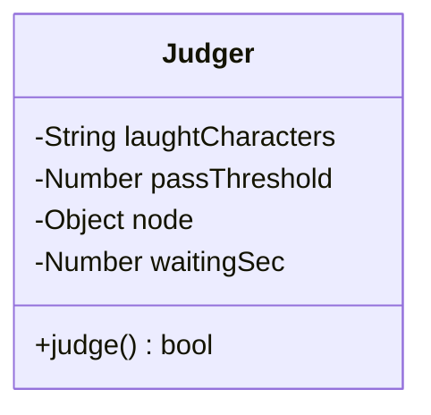
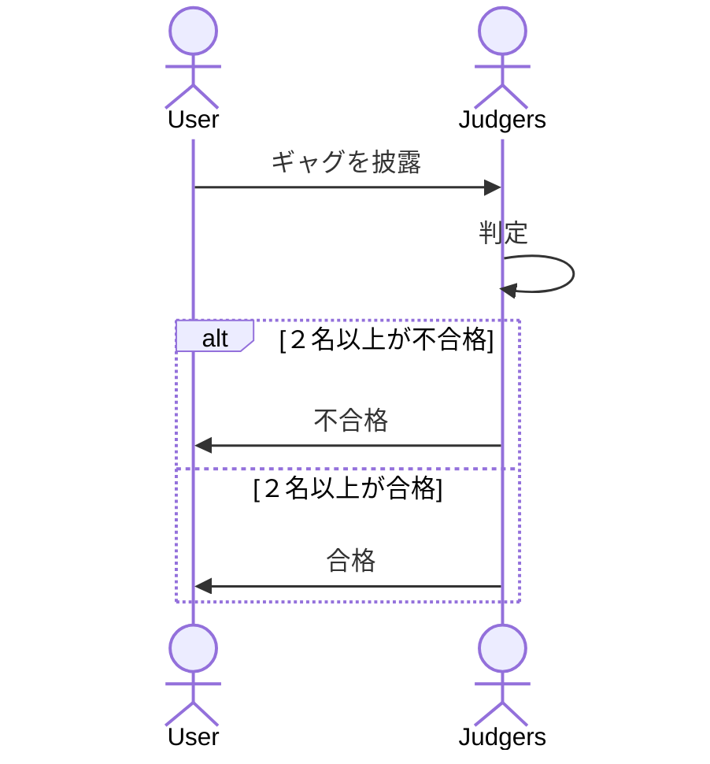

# 設計

## クラス図

## シーケンス図

## ギャグ判定ロジック

- ギャグの文字列を固定長のハッシュに変換
- 審査員ごとに異なる笑いのツボを、文字種類(laughtCharacters) で定義
- laughtCharacters にマッチした文字数の、全ハッシュ長に対する割合(passThreshold) で判定
  - passThreshold の値以上だと合格
  - passThreshold の値未満だと不合格
