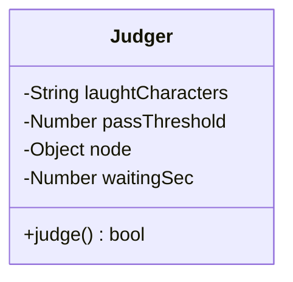
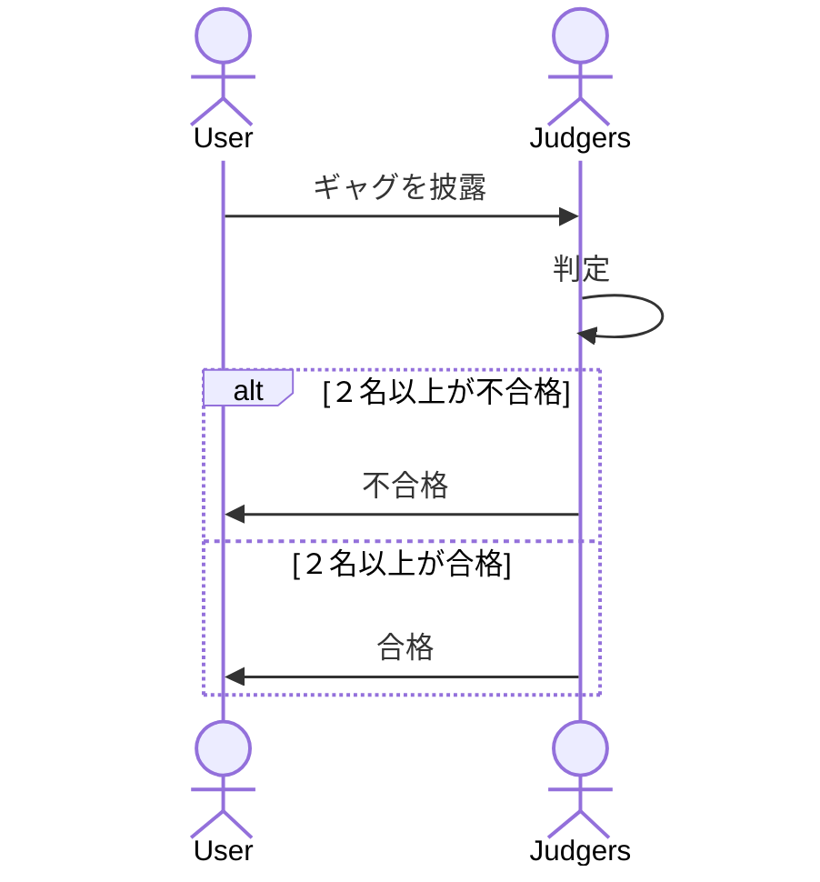

# 設計

## クラス図

```mermaid
classDiagram
    class Judger{
        -String laughtCharacters
        -Number passThreshold
        -Object node
        -Number waitingSec
        +judge() bool
    }
```

## シーケンス図

```mermaid
sequenceDiagram
    actor User
    actor Judgers
    User->>Judgers: ギャグを披露
    Judgers->>Judgers: 判定
    alt ２名以上が不合格
        Judgers->>User: 不合格
    else ２名以上が合格
        Judgers->>User: 合格
    end
```
