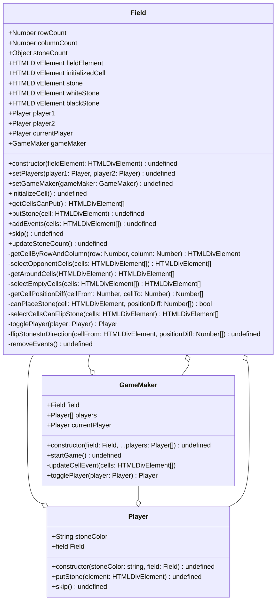

## クラスごとの責務

- Field
  - 盤面に関する値の保持
    - 盤面のサイズ(行 × 列)
    - 盤面を表す HTMLDivElement
    - セルの状態
  - 盤面を主体とする処理
  - 盤面のマウスオーバ、クリック時の挙動の実装
- Player
  - プレイヤーに関する値の保持
    - 石の色
  - プレイヤーを主体とする処理
- GameMaker
  - ゲームに関する値の保持
    - Field
    - Player
    - 現在の Player
  - ゲームを主体とする処理
    - ゲームの進行及び管理
      - プレイヤーごとの手番の管理
      - スキップの判定
      - ゲームの終了判定

## クラス図

