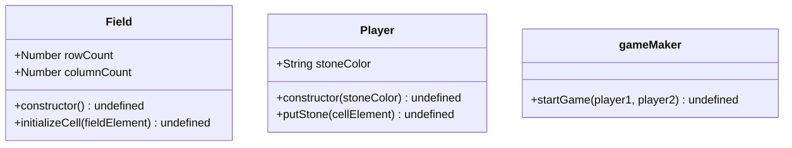
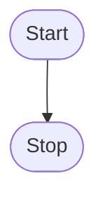

# 備忘メモ

- フィールドの初期化は js で記述する
  - セル数の可変に対応しやすくする為
  - html の記述量を減らして可読性を高める為
- 全体的な設計を考え直す
  - アクションごとの流れ
- サイズは絶対値指定せず、マージン確保した残り幅を活用する
  - aspect-ratio でできそう

```mermaid
classDiagram
  class Field{
    +Number rowCount
    +Number columnCount
    +constructor() undefined
    +initializeCell(fieldElement) undefined
  }
  class Player{
    +String stoneColor
    +constructor(stoneColor) undefined
    +putStone(cellElement) undefined
  }
  class gameMaker{
    +startGame(player1, player2) undefined
  }
```

```mermaid
flowchart TD
  Start([Start])
  Stop([Stop])

  Start --> Stop
```
